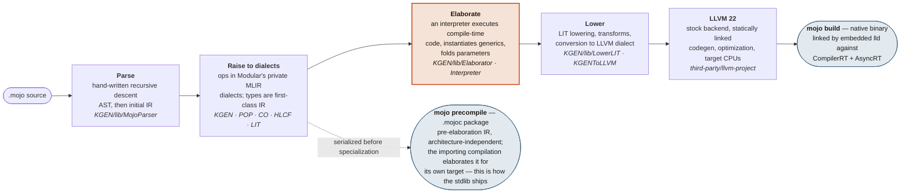
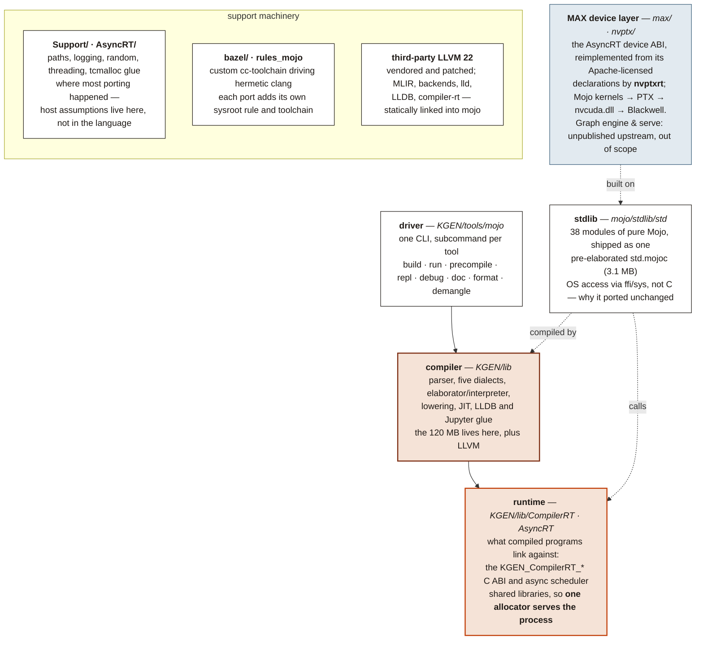

# WINMOJO x64 — Mojo 1.1 on Windows and NVIDIA Blackwell

**A personal-computer port of Mojo: the compiler and standard library, built to
run natively on hardware we own, using the operating-system features and the
specific accelerators that machine actually has.**

Mojo's premise is that one source file should specialise to whatever silicon
you point it at. These repositories take that premise literally and aim it at
ordinary personal computers — not a server, not a cloud instance, not a Linux
VM standing in for the real thing, but the machine on the desk. Each port
targets one host, one CPU, and one accelerator, and each is described the same
way: what runs, what does not, and what has merely been built rather than
tested.

## Acknowledgements

Mojo is a serious piece of language engineering, and Modular open-sourced the
compiler and the standard library under Apache 2.0 with LLVM exceptions — a
patent grant, no field-of-use restriction, and no hardware limits on the
source. That decision is what makes work like this both legal and possible:
you can take the source, aim it at hardware its authors never targeted, and
find out what happens. Not much of the industry gives you that.

It is worth being precise about how much it bought. These ports are not
rewrites; they are hooks into extension points that were deliberately left
public — target registries, the elaborator, the device ABI. Against a closed
compiler most of this would not have been a long job, it would have been an
impossible one.

Thanks to Chris Lattner and the team at Modular who designed and built Mojo,
and to everyone who has contributed to the compiler and the standard library
since. All original design credit is theirs. The mistakes in these ports are
ours.

Upstream is [modular/modular](https://github.com/modular/modular). If you want
supported Mojo, use [the real thing](https://mojolang.org) on a platform
Modular ships for.

## What this is

**An unofficial, unsupported fork of
[modular/modular](https://github.com/modular/modular) that ports the Mojo
compiler, standard library, MAX Mojo packages and GPU runtime to native
Windows x64, targeting an NVIDIA Blackwell GPU.**

It builds a native `mojo.exe`, supports both `mojo build` and `mojo run`, and
executes ordinary Mojo GPU kernels through PTX on the installed NVIDIA driver.
It does not use WSL, and it does not require the CUDA SDK, `nvcc`, `ptxas`,
`cudart`, cuBLAS or cuDNN.

> [!IMPORTANT]
> This is not a Modular product and is not affiliated with or supported by
> Modular or NVIDIA. Please report problems with this port here rather than to
> either vendor — nothing in this tree is theirs to answer for. It carries no
> warranty, it is not finished, and it does not accept contributions. See
> [An experiment, not a product](#an-experiment-not-a-product).

## The ports

Five machines, five ports, one language. Each row is a separate
repository. They share an ancestor and most of their tree, and differ in
host architecture, in which accelerator runtime is active, and in how far
each has been pushed — so the row for one is not evidence for another.
Where a claim in this README rests on work done in a sibling repository,
it says so.

| Port | Host | Reference hardware | Accelerator path | Where it stands |
| --- | --- | --- | --- | --- |
| [**WINMOJO**](https://github.com/albanread/WINMOJO) | Windows 11 ARM64<br/>`aarch64-pc-windows-msvc` | Qualcomm Oryon (Snapdragon X)<br/>Adreno X1-45 | Mojo → SPIR-V → OpenCL,<br/>via `dragonrt` | `mojo build` and `mojo run` both work; lldb builds and debugs Mojo binaries; Adreno Mandelbrot at 11–13 ms/frame; 258 of 369 stdlib test targets pass |
| [**maxdragon**](https://github.com/albanread/maxdragon) | Windows 11 ARM64<br/>`aarch64-pc-windows-msvc` | Qualcomm Oryon (Snapdragon X)<br/>Adreno X1-45 · Hexagon NPU | Mojo → SPIR-V → OpenCL,<br/>via `dragonrt`; the NPU through QNN at graph level, outside Mojo | `mojo build` works; the JIT is not enabled on this branch; the Adreno acceptance test passes and Mandelbrot runs at 16 ms/frame against 250 ms on one CPU core; the Hexagon reaches 4.1× the CPU on gigabyte-scale graphs; 258 of 369 stdlib test targets pass |
| [**WINMOJOX64Blackwell**](https://github.com/albanread/WINMOJOX64Blackwell) ← *you are here* | Windows 11 x64<br/>`x86_64-pc-windows-msvc` | Intel Core Ultra 9 285H<br/>NVIDIA RTX PRO 2000 Blackwell (`sm_120a`) | Mojo → PTX → `nvcuda.dll`,<br/>via `nvptxrt` | `mojo build` and `mojo run` both work; TMA, CUDA graphs, completion flags and host callbacks all tested on hardware; REPL and LLDB packaged; no systematic SM120a kernel census yet |
| [**MojoMacX64**](https://github.com/albanread/MojoMacX64) | macOS x86-64<br/>Mac Pro 2019 | Intel x86-64<br/>AMD Radeon Pro Vega II 32 GB (gfx906) | Mojo → AIR → Metal,<br/>via `MetalRT` | Cocoa apps build and run; `msg_send` materialised to C speed (3660 ns → 3 ns); a Mandelbrot at 60fps whose escape iteration *and* colour are Mojo kernels on the Vega II; wave64 matmul lands 3.4× on prefill; a Mojo editor written in Mojo |
| [**MojoCocoa**](https://github.com/albanread/MojoCocoa) | macOS ARM64<br/>Apple Silicon | Apple M4<br/>Apple GPU, 10 cores | Mojo → AIR → Metal<br/>(ported, never compiled) | **Newest, and not working yet.** The Cocoa compiler hook and `std.objc` pass 9 of 9 spikes and the example apps build, but the Apple Silicon GPU stack is ported source that has never been through a compiler |

None of these is finished, and none of them is trying to become the official port of anything.

## An experiment, not a product

This repository is an experiment. It exists to find out how much of Mojo and
its GPU runtime can be made to work on one Windows x64 machine with a Blackwell
card, and to record what was actually measured. That is its whole scope.

Stated plainly, so that nothing here is taken for more than it is:

- **It does not accept contributions.** There is no contributor guide, no CLA,
  no code of conduct and no review process. Pull requests will not be reviewed.
  The upstream contribution documents that came with the fork have been deleted
  rather than left in place to imply otherwise. A change that Mojo or MAX
  itself should have belongs upstream at
  [modular/modular](https://github.com/modular/modular), not here.
- **It does not claim to be complete.** No systematic MAX kernel census has
  been run on SM120a. Tensor-core, attention, reduction and communication paths
  are unvalidated on consumer Blackwell. Mixed CPU/GPU AsyncRT dispatch is a
  known unresolved gap. The release defaults to a single architecture target.
  [Known limitations and next work](#known-limitations-and-next-work) is the
  honest list, and it is longer than the achievements list.
- **It does not claim to be correct beyond what was measured.** Everything in
  [Test progress](#test-progress) was run on one reference machine, by one
  person, and is reported as observed. Passing focused tests is not the same as
  broad correctness, and nothing here should be read as coverage of hardware or
  code paths that were never exercised.
- **It is not supported and will not be.** No warranty, no roadmap, no release
  commitment, no obligation to keep working against future drivers, Windows
  builds, or upstream Mojo.

Reading it, building it, or taking ideas from it is what the licences permit
and you are welcome to all three. Just don't mistake it for a product, a
distribution, or a community.

## Current target

The reference machine used to develop and validate this branch is:

| Component | Reference system |
| --- | --- |
| Host architecture | Windows x64 (`x86_64-pc-windows-msvc`) |
| CPU | Intel Core Ultra 9 285H, 16 cores / 16 logical processors |
| Operating system | Windows 11 Enterprise x64, build 26200 |
| GPU | NVIDIA RTX PRO 2000 Blackwell Generation Laptop GPU |
| GPU memory | 8 GB |
| Compute capability | 12.0 |
| Mojo accelerator target | `sm_120a` |
| NVIDIA driver used for validation | 573.14 |
| Mojo version | 1.1.0 development source build |
| Branch | `windows-x64-nvidia-blackwell` |

The checked-in Bazel platform is
`//:windows_x86_64_nvidia_blackwell`. It deliberately selects x86-64 Windows,
the NVIDIA toolchain, and the RTX PRO 2000 Blackwell `sm_120a` target. This is
not the old Snapdragon build with its CPU or GPU labels changed at the command
line; the host toolchain, object format, JIT, debugger, runtime, examples, and
release packaging have all been ported to the new machine.

## Lineage

This work started from [albanread/WINMOJO](https://github.com/albanread/WINMOJO),
which was a native Windows ARM64 port for a Snapdragon X PC. That predecessor
used:

- an ARM64 Windows host compiler;
- Qualcomm Oryon CPU code generation;
- an Adreno GPU backend that emitted SPIR-V; and
- `dragonrt`, an AsyncRT-compatible OpenCL runtime for the Adreno GPU.

This repository is the next port of that work:

- ARM64 host code generation became native Windows x64;
- the reference CPU is Intel rather than Qualcomm Oryon;
- SPIR-V/OpenCL/Adreno became NVPTX/NVIDIA/Blackwell;
- `dragonrt` was replaced for the active target by `nvptxrt`; and
- the Git repository was reinitialized around this Windows x64 port.

Some ARM64, Adreno, and `dragonrt` sources remain in the tree as historical
work and useful reference implementations. They are not the active runtime or
the supported configuration of this branch. Old ARM benchmark counts and
Adreno coverage numbers do not describe this port.

## What has been achieved

The working GPU path is:

```text
Mojo source
    │
    ▼
KGEN + MLIR + LLVM NVPTX backend
    │
    ▼
PTX for sm_120a
    │
    ▼
nvptxrt.dll (open-source AsyncRT device ABI implementation)
    │
    ▼
nvcuda.dll (installed NVIDIA display driver and PTX JIT)
    │
    ▼
RTX PRO 2000 Blackwell GPU
```

`nvptxrt` dynamically loads the CUDA Driver API from `nvcuda.dll`. The build
and the standalone release therefore need the NVIDIA display driver to execute
GPU code, but they do not bundle or require NVIDIA's proprietary CUDA
development stack. Final PTX-to-machine-code compilation is performed by the
driver, as it must be for this hardware.

The windowed Mandelbrot example is the end-to-end demonstration. Its pixels are
computed by a Mojo kernel on the Blackwell GPU, copied back through `nvptxrt`,
and displayed in a native Win32 window. Both AOT compilation and `mojo run` JIT
execution have been verified.

## Feature coverage

The tables below describe this branch at revision `34db48b` and the hardware
tests run on 21 August 2026. “Implemented” means the required ABI and code path
exist. “Tested” additionally means the path ran successfully on the reference
machine.

### Windows host and compiler

| Area | State | Evidence or qualification |
| --- | --- | --- |
| Native Windows x64 compiler | **Implemented and tested** | `mojo.exe` is a native PE/COFF x64 executable. |
| AOT compilation | **Implemented and tested** | `mojo build` produces native Windows x64 executables. |
| JIT execution | **Implemented and tested** | `mojo run` uses the Windows RuntimeDyld path and runs CPU and GPU Mojo source. |
| Automatic NVIDIA selection | **Implemented and tested** | No accelerator flag and `--target-accelerator cuda` both detect this machine as `sm_120a`. |
| Mojo REPL | **Built and packaged** | LLDB, the Mojo LLDB plugin, and the REPL entry point are included in the release. |
| Crash reporting | **Built and packaged** | The Windows Crashpad handler and crash database layout are included. |
| Standard library | **Built** | Packaged as `std.mojoc`. The obsolete ARM64 test census has been removed from this README. |
| MAX Mojo package | **Built** | Packaged as `max.mojoc`; this does not imply that every MAX kernel or Python service has been validated. |
| Win32 API metadata | **Implemented** | The compiler consumes `windows_api.db` for compile-time Win32 layout, constant, and COM queries. |
| Standalone release | **Implemented and tested** | Runs from `C:\projects\mojo_release` without Bazel. |

### NVIDIA runtime and GPU execution

| Area | State | Evidence or qualification |
| --- | --- | --- |
| Driver loading | **Implemented and tested** | Loads `nvcuda.dll` dynamically; no link-time CUDA SDK dependency. |
| Device discovery and metadata | **Implemented and tested** | Correctly reports one Blackwell GPU, compute capability 120, name, memory, and attributes. |
| Contexts and synchronization | **Implemented and tested** | Primary CUDA contexts, current-context scopes, stream and context synchronization. |
| Device and pinned host buffers | **Implemented and tested** | Allocation, release, sub-buffers, mapped host buffers, and ownership transfer. |
| H→D, D→H, and D→D copies | **Implemented and tested** | Small, 1 Mi-element, sub-buffer, and non-owning alias paths pass. |
| Memory fill | **Implemented and tested** | 8-, 16-, 32-, and 64-bit paths, including graph memset nodes. |
| Streams, events, and timers | **Implemented** | Core stream/event AsyncRT ABI is present; the windowed example and focused runtime tests use it. |
| PTX module and kernel launch | **Implemented and tested** | Module loading, function lookup, normal launch, launch attributes, and constant memory. |
| Occupancy and function attributes | **Implemented** | CUDA Driver API queries are exposed through the MAX Mojo host API. |
| Blackwell TMA | **Implemented and tested** | Correct grid-constant ABI, 64-bit generic pointers, descriptor lifetime, and a verified 8×8 tile copy. |
| CUDA graphs | **Implemented and tested** | Kernel, copy, memset, empty, host, and wait nodes; dependencies, regions, inputs, outputs, caching, instantiate, and replay. |
| Completion flags | **Implemented and tested** | Mapped pinned flags, host signal/reset/load, stream wait, and graph wait. |
| GPU host callbacks | **Implemented and tested** | Direct stream callbacks and recorded CUDA graph host nodes pass. |
| Peer capability and enablement | **Implemented** | Per-pair and all-device APIs are present and self-access correctly reports false. |
| Cross-device copy | **Implemented, not hardware-tested** | Uses `cuMemcpyPeerAsync`; falls back to a host-staged copy when the driver rejects direct peer access. This PC has only one GPU. |
| Multicast/NVSwitch memory | **Not implemented** | Capability reports false and calls fail with a clear error instead of an unresolved symbol. |
| CUDA vendor libraries | **Not included** | No cuBLAS, cuDNN, NCCL, or CUDA runtime dependency is bundled. Operations that require them need additional work. |

### MAX feature coverage

This port now supports a substantial part of the MAX Mojo GPU host layer, but
it does **not** claim universal MAX coverage.

| MAX area | Coverage |
| --- | --- |
| Mojo-authored GPU kernels using standard NVPTX operations | Working for the tested kernels and examples. |
| Device contexts, buffers, streams, events, launches, graphs, and host synchronization | Implemented in `nvptxrt`. |
| SM120a TMA | Working on the reference Blackwell GPU. |
| Broad kernel catalogue | Partial; a complete Windows/SM120a test census has not yet been run. |
| SM120 tensor-core/TCGen05-specific paths | Not yet systematically validated. |
| Multi-GPU collectives and peer algorithms | Runtime foundations implemented; real multi-GPU hardware testing still required. |
| Multicast collectives | Unsupported. |
| Vendor-library-backed operations | Unsupported unless they have a pure Mojo fallback. |
| Python MAX graph, engine, pipelines, and serving stack | Outside the current standalone release and not validated by this port. |

The most valuable next coverage work is a systematic SM120a kernel census,
starting with matmul/tensor-core kernels, reductions, attention primitives,
layouts, and communication kernels. After that come real two-GPU peer tests,
mixed CPU/GPU AsyncRT dispatch, and multi-architecture packaging.

## Test progress

The following focused tests have run successfully on the reference system:

| Test | Result |
| --- | --- |
| Native compiler plus runtime build | Passed; the final focused rebuild executed 7 actions with the existing Bazel cache. |
| AsyncRT smoke test | 1/1 passed; device count is 1 and self peer access is false. |
| Completion flag suite | 2/2 passed with both automatic detection and explicit `--target-accelerator cuda`. |
| CUDA graph builder suite | 25 graph scenarios passed. |
| Blackwell TMA tile-copy test | Passed; all 64 output values were checked on the host. |
| Direct GPU host callback test | 1/1 passed. |
| Multicast capability test | Passed by correctly reporting that multicast is unsupported. |
| GPU copy coverage | Normal, large, sub-buffer, and non-owning alias cases passed. |
| Windowed NVIDIA Mandelbrot | Passed as an AOT executable and through `mojo run`; every frame is recomputed on the GPU. |

One upstream copy test also creates a CPU `DeviceContext` after finishing its
GPU checks. Its GPU sections pass, but the final mixed CPU/GPU section currently
stops because `nvptxrt` owns an unnamespaced `AsyncRT_DeviceContext_*` ABI and
does not dispatch CPU context objects to the CPU provider. This is a known
integration gap, not a failed GPU copy.

Bazel's default Windows test execution toolchain is not registered for these
GPU tests in this tree, so the hardware tests above were run directly with the
newly built `mojo.exe`. Focused Bazel build targets are used to compile the
compiler and runtime without invalidating thousands of cached components.

### Measured baselines

`nvidia_mandelbrot` prints a CPU/GPU comparison before it opens its window.
That comparison, not the frame rate, is the number worth keeping.

| Card | Arch | GPU ms/frame | CPU 1 core | Speedup | Pixels differing |
| --- | --- | --- | --- | --- | --- |
| T1000 8GB | `sm_75` | 1 | 152 ms | 97x | 0 of 691,200 |
| RTX 3060 (desktop) | `sm_86` | *not measured* | | | |
| RTX PRO 2000 Blackwell Laptop 8GB | `sm_120a` | 1 | 136 ms | 117.2x | 0 of 691,200 |

Grid 960x720 at `max_iter 512`, about 73M iterations.

Both measured cards report 1 ms, so this benchmark does not separate them: the
difference in the speedup column is almost entirely the CPU denominator, and
the workload is too small to load either GPU. Ranking cards would need a larger
grid or sub-millisecond timing. What the table does establish is the last
column, identical across five architecture generations.

The Blackwell row is the median of six warm process runs on the reference
Core Ultra 9 285H laptop with NVIDIA driver 573.14, measured on 21 August
2026. Every warm GPU sample rounded to 1 ms; the single-core CPU median was
136 ms and speedup ranged from 95.9x to 123.7x, with a 117.2x median. All six
runs produced exact agreement for all 691,200 pixels. The benchmark currently
prints whole milliseconds, so the table does not imply sub-millisecond timing
precision.

The discarded cold-after-idle Blackwell sample was 3 ms, 137 ms on one CPU
core, and 39.5x. The timed GPU interval includes both kernel execution and the
device-to-host readback used for validation.

Two cautions when adding a row. **Discard the first run after boot**: on cold
clocks the T1000 reported 7 ms and 21x, against 1 ms and 97x on every warm run
after it. **Ignore the frame rate**: the loop calls `Present` with an interval
derived from the display refresh rate, so it reports 59-60 fps on any card
fast enough to keep up, and says nothing about the GPU. During the T1000 run
the card sampled at only ~32% utilisation, holding 59 fps with the SM clock
idling around 1021 MHz.

The pixel-agreement column is the real correctness check, since the example
compares every pixel against a single-threaded CPU reference.

## PTX portability

PTX is portable within the architecture and feature contract encoded in the
module; `sm_120a` is not a universal NVIDIA target. The current default is
intentionally optimized for this machine and uses architecture-specific
Blackwell features.

The compiler and runtime now recognize Windows NVIDIA architectures and append
the architecture-specific `a` suffix for the known targets that require it.
Three cards are registered: the RTX PRO 2000 Blackwell Generation (`sm_120a`),
the RTX 3060 (`sm_86`, Ampere), and the T1000 (`sm_75`, Turing). Registering a
fourth takes two lines in `bazel/common.MODULE.bazel`, an `nvidia-smi` name
substring in `gpu_mapping` and an accelerator in `supported_gpus`. Add a
`platform` in `BUILD.bazel` and a `--config` in
`bazel/internal/common.bazelrc` as well if the card should be selectable from a
machine that does not have it installed.

Watch the ordering in `gpu_mapping`: matching stops at the first substring hit
in insertion order, and the `"Laptop GPU": ""` entry deliberately ignores
mobile parts. A desktop key placed after it, as `"NVIDIA GeForce RTX 3060"` is,
will not pick up the mobile variant of the same chip.

These three span every feature gate that matters. `sm_86` clears
`_is_sm_8x_or_newer()`, so `cp.async`, `mbarrier`, bf16 and tensor cores are
available on the 3060 but not the T1000; `sm_120a` additionally clears the
`sm_90`+ tier that brings TMA and clusters. A kernel that compiles for all
three has been checked against the whole span the port supports.

A future general release should still contain multiple PTX targets, or select
one at installation or run time, rather than ship a single machine's
configuration.

## Building from source

### Prerequisites

- Windows 11 x64;
- Visual Studio 2022 Build Tools with the MSVC x64 toolchain and Windows SDK;
- Git with long paths enabled;
- Windows Developer Mode for efficient symlink-based Bazel runfiles;
- a current NVIDIA display driver for GPU execution; and
- enough disk space for a large LLVM/MLIR source build.

The CUDA toolkit is optional for diagnostics and is not a build dependency of
`nvptxrt`.

### Machine-local Bazel configuration

Create `local.bazelrc` at the repository root. This is the validated
configuration for the reference machine:

```bazelrc
startup --output_base=C:/b/w
build --config=build-mojo
build --compilation_mode=opt
build --//:modular_config=production
build --jobs=12
build --experimental_disk_cache_gc_max_size=10G
build --experimental_disk_cache_gc_idle_delay=5s
```

A GPU `--config` is no longer part of that list. Detection runs on Windows now,
so the installed card is identified from `nvidia-smi` and selects its own
toolchain. Name a target explicitly only to build for a card this machine does
not have:

| Config | Builds for | Accelerator |
|---|---|---|
| *(none)* | the installed card | detected |
| `--config=windows-nvidia-blackwell` | RTX PRO 2000 Blackwell | `sm_120a` |
| `--config=windows-nvidia-rtx3060` | RTX 3060 (desktop) | `sm_86` |
| `--config=windows-nvidia-t1000` | T1000 | `sm_75` |

Each selection is a distinct platform and so gets distinct output paths, which
means two cards' artifacts coexist in the disk cache instead of invalidating
each other. Adjust the job count and cache limit to the machine.

The short output base keeps Windows path lengths under control. The disk-cache
limit prevents Bazel from consuming the system drive indefinitely. Avoid
`bazel clean --expunge` during normal work: it throws away valid LLVM, compiler,
and runtime artifacts and forces an enormous rebuild.

### Focused builds

Use the repository wrapper, not a separately installed Bazel:

```powershell
.\bazelw.cmd build //KGEN/tools/mojo:mojo //nvptx/runtime:nvptxrt.dll
.\bazelw.cmd build //mojo/stdlib/std:std //max/mojo/max:max
.\bazelw.cmd build //examples/win32:nvidia_mandelbrot
```

Build debugger components only when needed:

```powershell
.\bazelw.cmd build //KGEN:MojoLLDB `
  //KGEN/tools/mojo-repl-entry-point:mojo-repl-entry-point
```

With an intact output base, editing `nvptxrt.cpp` normally rebuilds and links
only a handful of actions. Changing widely included compiler headers can still
cause a larger relink.

## Running from the build tree

Point the JIT at the NVIDIA AsyncRT provider:

```powershell
$env:MODULAR_MOJO_MAX_SHARED_LIBS = `
  (Resolve-Path 'bazel-bin/nvptx/runtime/nvptxrt.dll').Path
$mojo = 'bazel-bin/KGEN/tools/mojo/mojo.exe'
```

Run ordinary Mojo source with automatic GPU detection:

```powershell
& $mojo run -I mojo/stdlib -I max/mojo program.mojo
```

Or request the generic CUDA selector, which resolves to `sm_120a` on the
reference machine:

```powershell
& $mojo run --target-accelerator cuda `
  -I mojo/stdlib -I max/mojo -I max/kernels/src program.mojo
```

Run the prebuilt windowed Mandelbrot example:

```powershell
.\bazel-bin\examples\win32\nvidia_mandelbrot.exe
```

The source is
[examples/win32/nvidia_mandelbrot.mojo](examples/win32/nvidia_mandelbrot.mojo).
It prints a startup CPU/GPU comparison, opens a native Win32 window, and reports
the final frame count when closed.

## Focused hardware test commands

After defining `$mojo` and `MODULAR_MOJO_MAX_SHARED_LIBS` as above:

```powershell
# Runtime smoke and peer semantics
& $mojo run -I mojo/stdlib -I max/mojo -I max/mojo/test/asyncrt `
  max/mojo/test/asyncrt/test_smoke.mojo

# Completion flags and host/graph synchronization
& $mojo run --target-accelerator cuda `
  -I mojo/stdlib -I max/mojo -I max/mojo/test/asyncrt `
  max/mojo/test/asyncrt/test_completion_flag.mojo

# Full CUDA graph builder suite
& $mojo run -I mojo/stdlib -I max/mojo -I max/kernels/src `
  max/kernels/test/gpu/device_context/test_device_graph_builder.mojo

# SM120a TMA correctness
& $mojo run -I mojo/stdlib -I max/mojo -I max/kernels/src `
  max/kernels/test/gpu/memory/test_tma.mojo

# Direct stream host callback
& $mojo run -I mojo/stdlib -I max/mojo -I max/mojo/test/asyncrt `
  max/mojo/test/asyncrt/test_host_func.mojo
```

## Standalone release

The release packager gathers the compiler, standard library, MAX Mojo package,
NVPTX runtime, LLDB/REPL support, Crashpad, Windows API metadata, and the
Mandelbrot example:

```powershell
.\release\windows\create-release.ps1 `
  -Destination C:\projects\mojo_release
```

The existing reference release is deliberately independent of Bazel at run
time. Its launchers configure package lookup, runtime DLLs, Windows metadata,
LLDB, Crashpad, the compiler cache, and the Visual Studio x64 library paths.

```text
mojo.cmd --version
mojo.cmd run examples\hello.mojo
mojo.cmd build examples\hello.mojo -o hello.exe
mojo-gpu-run.cmd file.mojo
mojo-gpu-build.cmd file.mojo -o file.exe
mojo.cmd repl
mandelbrot.cmd
```

The repository README describes current source progress. The release directory
is a fixed artifact and is not silently rewritten while runtime development
continues; regenerate it explicitly when a new release is wanted.

## Repository map

| Path | Purpose |
| --- | --- |
| `KGEN/` | Mojo compiler, Windows JIT/AOT support, accelerator detection, LLDB plugin. |
| `mojo/stdlib/` | Mojo standard library and Windows/NVPTX target descriptions. |
| `max/mojo/max/` | MAX Mojo host APIs used by the NVIDIA runtime. |
| `max/kernels/` | Mojo GPU kernels and the focused graph/TMA tests. |
| `nvptx/runtime/` | Windows NVIDIA AsyncRT implementation over the CUDA Driver API. |
| `examples/win32/` | Native Windows examples, including NVIDIA Mandelbrot. |
| `release/windows/` | Standalone Windows x64 release templates and packager. |
| `dragon/runtime/` | Historical Snapdragon/Adreno runtime; not active for this target. |

## Known limitations and next work

1. Run a systematic MAX kernel census on SM120a and record pass/fail/unsupported
   results rather than inferring support from the host runtime ABI.
2. Validate tensor-core, TCGen05, attention, reduction, and communication paths
   specifically on consumer Blackwell.
3. Test direct peer access, peer copies, and collective algorithms on a real
   multi-GPU Windows system.
4. Add multicast/NVSwitch virtual-memory support where the Windows driver and
   hardware expose it.
5. Resolve mixed CPU/GPU AsyncRT symbol dispatch so CPU contexts and NVIDIA
   contexts can coexist in the same direct-JIT process.
6. Package multiple NVIDIA architecture targets rather than defaulting the
   entire release to `sm_120a`.
7. Expand validation from the Mojo kernel layer into the Python MAX graph,
   engine, pipelines, and serving stack if those components are brought into
   scope.

## Technical notes and journals

This README is the summary. The working record — including the retractions —
lives in the journals.

### The port itself

| Document | What it covers |
| --- | --- |
| [`PORT-JOURNAL.md`](PORT-JOURNAL.md) | The day-by-day record of the Windows and NVIDIA work: each defect, its root cause, and what was tried before the fix. |
| [`DRAGONMAX-JOURNAL.md`](DRAGONMAX-JOURNAL.md) | The GPU journal inherited from the Snapdragon line this port descends from. |
| [`docs/LANGUAGE-DRIFT.md`](docs/LANGUAGE-DRIFT.md) | Constructs the published documentation still teaches that this compiler version rejects. |
| [`docs/DIALECT-NOTES.md`](docs/DIALECT-NOTES.md) | How to write what this compiler actually accepts. |
| [`docs/win32_posix_shim.md`](docs/win32_posix_shim.md) | The POSIX shim the compiler runtime needs on Windows. |
| [`release/windows/README.md`](release/windows/README.md) | The standalone release layout. |

### NVIDIA Blackwell — the GPU device port

There is no standalone design paper for the NVIDIA line yet. That is stated
here rather than implied by an empty link: the record is the journal and the
runtime source, and the ABI document written for the Adreno line describes the
same contract `nvptxrt` implements.

| Document | What it covers |
| --- | --- |
| [`nvptx/runtime/nvptxrt.cpp`](nvptx/runtime/nvptxrt.cpp) | `nvptxrt` itself: the AsyncRT device ABI implemented against the CUDA Driver API, loaded dynamically from `nvcuda.dll`, with no link-time CUDA SDK dependency. |
| [`dragon/runtime/ABI.md`](dragon/runtime/ABI.md) | The `AsyncRT_DeviceContext_*` C ABI a device backend has to satisfy, extracted from the Mojo declarations that call it. Written for the Adreno line; the contract is the one `nvptxrt` implements. |
| [`dragon/recon/MAX-ANATOMY.md`](dragon/recon/MAX-ANATOMY.md) | What MAX actually is, open versus closed, determined by reading the tree. |
| [`dragon/design/OFFLOAD-FLOW.md`](dragon/design/OFFLOAD-FLOW.md) | How a compiled kernel travels from the object compiler to `loadFunction`, traced with file:line evidence. Written for SPIR-V; the carrying machinery is shared. |

### The Adreno line, inherited

This tree still carries the Snapdragon GPU work it descends from. It is not the
active runtime on this branch and its numbers do not describe this hardware,
but the design documents remain the clearest account of how a Mojo kernel
reaches a GPU that Modular does not ship for:
[`docs/SNAPDRAGON-GPU.md`](docs/SNAPDRAGON-GPU.md),
[`dragon/design/ARCHITECTURE.md`](dragon/design/ARCHITECTURE.md),
[`dragon/runtime/README.md`](dragon/runtime/README.md),
[`dragon/probe/CAPABILITIES.md`](dragon/probe/CAPABILITIES.md).

---

# Anatomy of Mojo

*What one large compiler binary actually contains, how a `.mojo` file becomes
machine code, and where the runtime, standard library and MAX fit around it —
as found in the source tree during these ports.*

| | |
| --- | --- |
| **1** | binary: `mojo` — driver, parser, compiler, JIT, REPL, LSP |
| **120 MB** | `mojo` itself, with LLVM + MLIR statically inside |
| **5** | private MLIR dialects (KGEN, POP, CO, HLCF, LIT) |
| **38** | stdlib modules, pure Mojo, zero C in the library itself |
| **322** | stdlib test files |

## Part I — What Mojo is

Mojo is a systems programming language wearing Python's syntax. Functions,
structs, traits and generics compile to native code with no interpreter and no
GC, and ownership and borrow semantics do the memory management. Older writing
about Mojo describes a Python-style `def` coexisting with a systems-style `fn`;
that is no longer true at this version, which rejects `fn` with *"'fn' has been
removed; use 'def' instead"*. It was built by Modular as the language for
writing AI kernels — code that must run on CPUs, GPUs and accelerators from one
source — and that origin explains its two defining traits.

First, it is **MLIR-native**. Where most languages lower their AST to LLVM IR
directly, Mojo parses into Modular's own MLIR dialects and does nearly all of
its work — metaprogramming, generics, optimisation — as MLIR transformations.
LLVM only sees the final, fully-specialised result.

Second, **compile-time execution is the metaprogramming system**. There is no
separate template or macro language: `@parameter` code, generic instantiation
and constant evaluation all run in a built-in interpreter that executes the
same IR the compiler is building. Types are values at compile time.

The consequence is the unusual shape of the distribution: one large binary
containing a full compiler stack, plus a small runtime the generated code calls
into, plus a standard library written entirely in Mojo itself.

## Part II — From source to machine code



JIT variants of the same pipeline back `mojo run` and the REPL
(`KGEN/lib/ExecutionEngine`).

**Why the elaborator is the hot stage:** generic instantiation by compile-time
interpretation is what lets one kernel source specialise for any target, and it
is why a `.mojoc` is portable while a `.o` is not. It is also why the compiler
needs its runtime present at build time — compile-time code allocates through
the same `KGEN_CompilerRT` ABI that compiled programs use at run time.

## Part III — How the repository composes



**The shape every one of these ports discovered:** the language is portable and
the *substrate* is not. The standard library reaches the OS through `ffi`/`sys`
rather than C, which is why it moves to a new platform almost unchanged; the
host assumptions that had to be fixed live in `Support/`, `AsyncRT/` and the
Bazel toolchain. And the device layer is the one genuinely missing piece —
Modular publishes the API a kernel calls and the declarations of the ABI
underneath it, but not an implementation for hardware they do not ship for.
Each port here writes its own.

## Licence and attribution

The Mojo compiler (`KGEN/`), the C++ substrate, and the standard library are
licensed Apache 2.0 with LLVM exceptions, and this fork inherits that licence.
Everything added here carries the same licence.

This tree contains files under more than one licence. Read the root
[LICENSE](LICENSE), the [Licenses/](Licenses/) directory, the third-party
notices, and the licence header of each source file before redistributing a
build.

`LICENSE` and `Licenses/` are kept exactly as upstream has them, deliberately:
almost every file here is still Modular's Apache-2.0 code, a derivative work
has to ship the licence with it, and the same grant is what puts this fork's
own additions on a clear footing.

No Modular binary, wheel, or account has been used in this work. Everything
here is built from the published Apache-licensed source, and where a device
runtime was needed it was implemented against the published ABI rather than
extracted from a binary.

Upstream is [modular/modular](https://github.com/modular/modular). All
original design credit belongs to Modular.

I am not a lawyer, and nothing here is legal advice.
