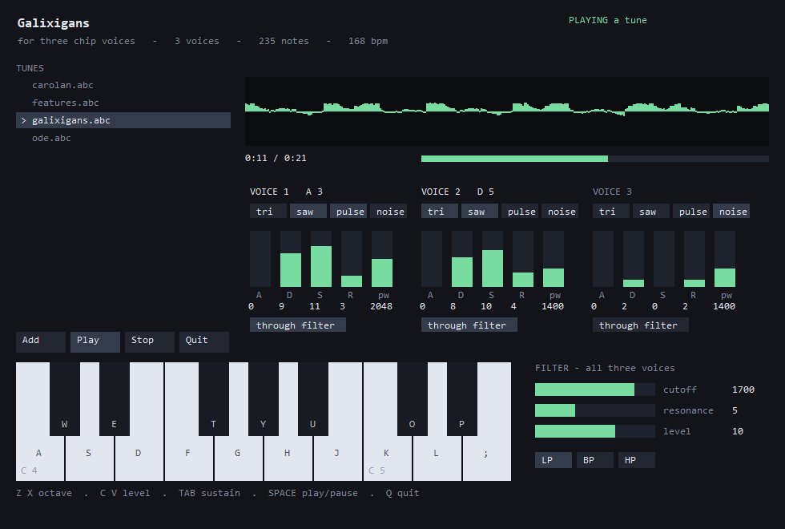

# abcplayer

Reads ABC notation -- the format thousands of folk tunes are already written
in -- and plays it, either through a 6581-flavoured chip synthesiser or through
the General MIDI synthesiser Windows already has. It also writes Standard MIDI
Files.



```
abcplayer.exe                          the window, live keyboard
abcplayer.exe tunes\carolan.abc        the window, playing that tune
abcplayer.exe tunes\ode.abc --midi     the same, through Windows' own synth
abcplayer.exe tunes\ode.abc --write=out.mid    a MIDI file, and no window
abcplayer.exe tunes\ode.abc --selftest         no window, and a verdict
abcplayer.exe --ms 5000                open the window, close it after 5 s
```

Build it from the repository root:

```bash
export MODULAR_MOJO_MAX_WINKB_PATH="F:/bzs/external/+http_archive+winkb/windows_api.db"
export PATH="/c/Users/alban/AppData/Local/Temp/griddle-linkbin:$PATH"
./bazel-bin/KGEN/tools/mojo/mojo.exe build --no-optimization \
    -I mojo/stdlib -I . -I max/mojo \
    -Xlinker "$(cygpath -w bazel-bin/nvptx/runtime/nvptxrt.if.lib)" \
    -o build/abcplayer.exe examples/win32/abcplayer/main.mojo
export PATH="bazel-bin/KGEN:bazel-bin/AsyncRT:bazel-bin/Support:$PATH"
./build/abcplayer.exe examples/win32/abcplayer/tunes/galixigans.abc
```

This is the port of the MojoCocoa `abcplayer` example. The parser, the model,
the repeat expander, the tick arithmetic, the chip and the MIDI file writer are
the same code; everything that touches a speaker, a screen or a file is new.

## The controls

| | |
|:---|:---|
| click a tune, then **Play** | load and play it, looping |
| **Add** | a file dialog, for a tune that is not in `tunes\` |
| **Stop** | back to live mode, where the keyboard plays |
| `Space` | play, or pause a playing tune |
| `Z` `X` | octave down / up |
| `C` `V` | master level down / up |
| `Tab` | sustain |
| `Q` `Esc` | quit, as does closing the window |

and the letter keys are a piano, in Logic Pro's and GarageBand's *Musical
Typing* layout -- kept from the Mac version because it is a good mapping and
because somebody who knows both machines should not have to learn it twice:

```text
     W E   T Y U   O P          the black keys, in their piano positions
    A S D F G H J K L ;         the white keys, from C
```

`R` and `I` are gaps because a piano has no black key between E and F, or
between B and C. `Z X C V` are free for the other job precisely because they
are not note keys.

Velocity is deliberately absent. The chip has no per-note velocity -- neither
did the 6581 -- so `C` and `V` move the master level, which is the register
that exists.

## What it demonstrates

**One schedule, two backends, and the difference between them is only who owns
the clock.** The tune is compiled to a list of *"at this moment, do this"*, and
a backend decides what "this" means. Nothing about the music -- the parse, the
repeats, the ties, the ordering, the tie-break that releases a note before
striking another at the same instant -- is written twice, so nothing about it
can differ between the two.

**A render callback that nobody calls.** CoreAudio hands a function pointer to
the system and the system calls it on a thread it owns. WASAPI inverts that:
you get a ring buffer and an event, and you are the thread. So the callback
becomes the body of a loop -- and `render_scheduled` in `chipplay.mojo`, which
*is* that callback, did not change by one line for the port. It was already
written as a function of (state, destination, frames), which is the only shape
either system needs.

**Sample-exact timing, measured rather than claimed.** An event scheduler
usually asks the operating system to wake a thread at a moment, and it will be
late by whatever the scheduler is busy with -- a millisecond or two idle, tens
under load. At 120bpm a semiquaver is 125 ms, so a 5 ms error is 4% of a note,
and the error changes from note to note, which is what makes it audible as
looseness rather than as a tempo. Here every event carries a sample index and
the fill loop renders in spans *between* events, so a note that begins 137
samples into a buffer begins on sample 137. `--selftest` measures it (below):
**worst error 0 samples**.

**A complicated parser is a real test of a language.** ABC is terse and
ambiguous in exactly the places real tunes use: `(` opens a slur unless a digit
follows, `[` opens a chord unless it is `[K:`, `|` is a bar line unless a digit
follows, and an accidental holds *to the end of its bar*, so the second F in
`^F A F` is also sharp and the third, in the next bar, is not.

**Everything Windows-shaped comes from the metadata.** WASAPI's interface IIDs
and vtable slots, `midiStreamOut`'s DLL, `MIDIHDR`'s field offsets, `MMTIME`'s
size, GDI's font-quality constants, the virtual key for a semicolon -- all of
it is a query against `windows_api.db`, so an unknown name is a compile error
rather than a wrong number. Two GUIDs are written by hand and both are named
below.

## What to look for

**`tunes/galixigans.abc` is the demonstration.** A dive where the pulse width
narrows and the filter closes as they come at you, a four-step power-up with
the cutoff opening on every bar, and a fanfare. Watch the panel while it plays:
the bars and the cutoff slider are reading the *chip's own registers*, not the
window's copy of them, so a tune moving the sliders is the tune reaching into
the hardware. It is in A minor throughout the defence and ends in A major; the
picardy third is the joke, because it is a triumphant ending and the triumph is
not ours.

**Three voices means three notes.** Hold a fourth key and the oldest is stolen,
which is what a three-oscillator chip has to do.

**The waveform toggles are toggles, not a radio group.** The chip ANDs selected
waveforms together -- an accident of how the outputs were wired, and the source
of most of the timbres people remember -- so turning on `saw` *and* `pulse`
gives you the AND of the two, and turning all four off gives silence, which is
what the register means.

**`--midi` and `--chip` play the same tune at the same tempo.** Start one, stop
it, restart with the other flag, and the difference should be entirely in the
sound. Chip register directives are silently dropped in `--midi` -- there is no
honest way to approximate a pulse width on a General MIDI piano -- and the
window says so where the registers are.

**`--write` is the proof that outlives the program.** The MIDI file opens in any
notation program, so the pitches, the lengths and the bar positions can be
checked by something that was not written here.

## Changing the sound mid-tune: `[I:chip ...]`

ABC's `I:` field is specified as instructions to the software, which is exactly
what a chip register is, so the directive goes there rather than inventing
syntax nobody else would recognise. It is inline, so it applies at the point in
the music where it is written:

```abc
[I:chip v=1 wave=pulse pw=1100 a=0 d=6 s=9 r=3 cutoff=1200 res=7 vol=11]ACEA cAec
[I:chip v=1 pw=350 cutoff=450]aged cAEC
```

| Key | |
|:---|:---|
| `v=` | which voice the per-voice keys apply to |
| `wave=` | `tri` `saw` `pulse` `noise`, joinable with `+` |
| `pw=` | pulse width, 0-4095 |
| `a= d= s= r=` | envelope, 0-15 each |
| `filt=` | `on` / `off` -- route this voice through the filter |
| `cutoff= res= mode=` | the shared filter: 0-2047, 0-15, `lp` `bp` `hp` |
| `vol=` | master level, 0-15 |

A directive is not special machinery. It becomes a step at a sample position
exactly like a note-on, and is applied by a function that allocates nothing and
cannot raise -- the same contract the notes keep, because it runs from the same
place they do.

## How it is put together

| File | What it does | Ported from |
| --- | --- | --- |
| [model.mojo](model.mojo) | events, voices, key-signature arithmetic | unchanged |
| [parse.mojo](parse.mojo) | headers, and the header/body split at `K:` | unchanged |
| [music.mojo](music.mojo) | the music-line parser | unchanged |
| [repeats.mojo](repeats.mojo) | repeats and endings, expanded over events | unchanged |
| [schedule.mojo](schedule.mojo) | ticks to samples; ties; ordering | one field added |
| [chip.mojo](chip.mojo) | the synth engine: oscillators, ADSR, filter | two lines |
| [chipplay.mojo](chipplay.mojo) | driving the chip from a schedule | allocator only |
| [smf.mojo](smf.mojo) | Standard MIDI File output | the file write |
| [wasapi.mojo](wasapi.mojo) | the speaker | new |
| [winmidi.mojo](winmidi.mojo) | the system synthesiser | new |
| [win32.mojo](win32.mojo) | the shared Win32 odds and ends | new |
| [ui.mojo](ui.mojo) | the panel, drawn with GDI | rewritten |
| [main.mojo](main.mojo) | arguments, the window, and the one loop | rewritten |

**Time is an integer everywhere.** Durations are ticks at 480 per quarter note
-- MIDI's own resolution -- which divides exactly by everything ABC can ask
for: a 1/64 note is 30 ticks, a triplet eighth is 160, a dotted quarter is 720.
Nothing rounds until the single conversion to samples, so a tune that should
land on the bar line does, however many tuplets and dots came first.

### The chip: WASAPI, shared, event-driven

Seven steps, all in `wasapi.mojo`: create the device enumerator, get the
default render endpoint, `Activate` an `IAudioClient` off it, read the mix
format, `Initialize`, create an event and `SetEventHandle`, and `GetService`
the render client. Then the loop primes the whole ring by hand -- the event is
never signalled before the stream runs, so the first buffer is ours to fill --
calls `Start`, and from then on writes exactly what has drained and not one
frame more.

Shared mode, not exclusive, for three measured reasons. This machine's mix
format is refused outright in exclusive mode
(`AUDCLNT_E_UNSUPPORTED_FORMAT`), so exclusive would mean negotiating a
hardware format and writing a second output path for it. Exclusive mode evicts
every other application on the endpoint, which is wrong for an example somebody
runs while music is playing. And the latency it would buy is not needed: the
engine already wakes us every 10 ms.

The mix format is a statement, not a request -- the engine is running at 48 kHz,
two channels, 32-bit float and everything we produce has to arrive in it. The
float-versus-integer decision is made without a hand-written GUID:
`KSDATAFORMAT_SUBTYPE_IEEE_FLOAT` is the `WAVE_FORMAT_*` tag promoted into a
GUID, so its `Data1` **is** the tag, and comparing that against the metadata's
own `WAVE_FORMAT_IEEE_FLOAT` is enough. The chip's `SAMPLE_RATE` is checked
against the engine's rather than assumed; they agree at 48000 here, and a
machine where they did not would play the whole tune at the wrong pitch, which
the program says out loud rather than leaving you to notice.

**An underrun is completely silent.** `GetBuffer`, `ReleaseBuffer` and `Start`
all return `S_OK` straight through one. `GetCurrentPadding == 0` on a wake is
the only reporter there is, so the loop counts those and the window shows the
count.

### MIDI: `midiStreamOut`, because there is no sample offset to give

`--midi` on the Mac hands each event to Apple's DLS synth through
`MusicDeviceMIDIEvent`, which takes a sample offset inside the buffer being
rendered. The MIDI backend therefore gets exactly the timing the chip backend
gets, from the same schedule, in the same callback.

Windows has no such call, and this is the one place where the port had to
change the shape of the design rather than just its spelling. The system
synthesiser is a MIDI *device*, not an audio unit that can be pulled into a
buffer we own, so there is no buffer to offset into. `midiOutShortMsg` sends a
message *now*, and "now" from a loop that wakes every ten milliseconds is a
tenth of a semiquaver at 120bpm -- audible, and worse, variable.

So the Windows answer is to stop sending events and hand over the schedule.
`midiStreamOut` takes a whole array of tick-stamped events and the driver plays
them against its own clock, which is what `MusicDeviceMIDIEvent`'s offset
argument is really asking for. That is why a `Step` carries its **tick** as
well as its sample: the chip is rendered here and wants samples, the driver
schedules there and wants ticks, and carrying both means the one conversion
still happens once, in one place, for both. The stream's time division is set
to 480 -- the model's own tick -- so nothing is converted and nothing rounds.

The honest limit: the resolution is the driver's timer, not the sample.
Windows' software synthesiser schedules on a one-millisecond tick, against the
chip backend's measured zero.

Looping is the same buffers again. A header the driver has finished with comes
back marked `MHDR_DONE` and is still prepared, so a repeat is clearing that one
bit and handing the same memory over a second time; nothing is reallocated and
no event is rebuilt.

### One thread, one loop

The window and the audio share a thread, and `MsgWaitForMultipleObjects` is
what makes that reasonable: it blocks on the audio event and the message queue
at once, so the loop is never late for either. There is no audio thread, no
lock, and no cross-thread anything -- the "unsynchronised on purpose" scope
copy the Mac version needs is not even unsynchronised here, because there is
nothing to be unsynchronised with.

The cost is real and worth naming. Anything that blocks blocks the speaker. The
file dialog is the case that bites: `IModalWindow::Show` runs its own message
loop and does not return until the user is done, so the fill loop is not
running for as long as it is open. A ring nobody is filling is not silence, it
is a starved stream repeating its last contents -- so `Add` stops the audio
client, `Reset`s it (Stop does *not* empty the ring, and asking for the whole
ring while it is still occupied is `AUDCLNT_E_BUFFER_TOO_LARGE`, which took the
program down before that line existed), and primes and restarts it afterwards.
An audio thread would have kept playing. This one is quiet, on purpose, and
says so.

Loading a tune is the same problem in miniature: parsing a file takes tens of
milliseconds in a build with no optimisation. The stream is started *after* the
first tune is loaded rather than before, which is worth a line here because
getting it the other way round cost exactly one underrun on the first note of
every run, and that is what it looked like from the outside.

### Drawing

Everything draws itself: the panel is about ninety filled rectangles and sixty
runs of text, so there is no button control and no trackbar. Straight into the
window's device context that would be ninety visible steps; into a compatible
bitmap and blitted once inside `WM_PAINT`, it is one. `WM_ERASEBKGND` returns 1,
because letting GDI clear a client area that is fully redrawn anyway is what
makes a window flicker.

The window is a fixed size on purpose. Every rectangle is a constant and the
hit test reads the same constants, so a resizable window would need a layout
engine nobody asked for; `WS_OVERLAPPEDWINDOW` minus the sizing frame and the
maximise box says that to the user rather than making them find out.

## Evidence

`--selftest` opens no window and answers three questions. A real run:

```
$ ./build/abcplayer.exe examples/win32/abcplayer/tunes/galixigans.abc --selftest --seconds 3
metadata schema: 6
tunes found: 4
playing: Galixigans - for three chip voices   -   3 voices   -   235 notes   -   168 bpm
pitch check:
  pitches: 66 66 68 69 65 65 66
  key signature, accidentals and the bar reset: ok
timing check:
  blocks of 512 frames, which does not divide the note
  scheduled  0  24000  48000  72000
  measured   0  24000  48000  72000
  worst error 0 samples = 0.0 ms
sound check:
  WASAPI shared, 48000 Hz, 2 ch, float32, ring 5760 frames (120 ms)  {0.0.0.00000000}.{6cab32c5-c492-4d24-96e2-f5184e09d912}
  wakes 299  underruns 0  played 3.11 s
  our own samples peaked at 0.551325798034668
  endpoint peak meter reached 0.551325798034668
  AUDIBLE: we made samples and the device metered them
selftest ok
```

**The pitch check** is the two bugs the Mac port had to fix, checked rather
than believed. The C++ this descends from had key signatures that did nothing
and accidental parsing that could never run, so every tune played in C major.
`K:D` must sharpen F, `^G` must sharpen a G the key does not touch, and a
natural must hold for the rest of *its bar* and no longer: 66 66 68 69 | 65 65
| 66.

**The timing check** renders four quarter notes at 120bpm offline, through the
same `render_scheduled` the speaker uses, in 512-frame blocks -- a size chosen
because it does *not* divide the note length, so every onset after the first
falls in the middle of a block. The onset is then found in the output signal
rather than in the scheduler's own bookkeeping: the envelope is exactly zero
between notes and non-zero from the first sample of one, so the first non-zero
sample *is* the onset and there is no threshold to argue about. (The Mac
version reports a worst error of one sample; that is its detector's threshold,
not its scheduler.)

**The sound check** reports two numbers that are different claims. "Our own
samples peaked at" is what the synthesiser produced, scanned out of the buffer
on its way to the ring. "The endpoint peak meter reached" is what
`IAudioMeterInformation` says arrived at the device -- an instrument that
belongs to the endpoint and knows nothing about this program. Either alone is
weak: a run that produced silence can still meter whatever else the machine is
playing, and a buffer full of samples proves nothing about whether anything was
opened. Together, and agreeing to seven digits, they are the evidence. The
check fails if either is zero, or if the ring was ever found empty.

`--midi --selftest` runs the same first two checks and then opens the meter
alone -- there is no render stream in that mode, because the synthesiser has
its own path to the speakers:

```
$ ./build/abcplayer.exe examples/win32/abcplayer/tunes/ode.abc --midi --selftest --seconds 4
MIDI out: Microsoft GS Wavetable Synth
playing: Ode to Joy - Ludwig van Beethoven   -   2 voices   -   94 notes   -   140 bpm
  ...
sound check:
  midi stream position: 4499 ticks of 31650
  endpoint peak meter reached 0.10696890950202942
  AUDIBLE: the device metered the synthesiser
selftest ok
```

4499 ticks in four seconds at 140bpm is 1120 ticks a second, which is
`140 * 480 / 60` exactly -- the driver is running the model's own clock.

And `--write` is checkable by something that was not written here. All four
tunes produce format 1 files at 480 ticks per quarter that parse cleanly, with
note counts matching what the player reports (72, 39, 235, 94).

## Differences from the Cocoa version

Everything the Mac version does, this does, with these exceptions and
additions:

* **The MIDI backend schedules differently**, for the reason above: the driver
  places the events instead of the render callback, so the resolution is a
  millisecond rather than a sample. That is the one real loss in the port.
* **`Add` opens one file at a time.** The Mac's `NSOpenPanel` allows multiple
  selection; `IFileOpenDialog` does too, through `IShellItemArray`, and it is
  simply not wired up here.
* **`ABC_SHOT=<path>`** -- the Mac's draw-one-frame-and-exit door -- is not
  ported. `--ms N` (open the window, close it after N milliseconds) plays the
  same role for an unattended run, and the panel above was captured by driving
  the real window from outside with `PrintWindow`.
* **`--selftest` is new.** The Cocoa version has no equivalent; the pitch and
  timing checks it runs are checks of shared code, so they would work there too.
* **Layout arithmetic is simpler.** Cocoa measures from the bottom of the
  window and Windows from the top, so the Mac's `box()` helper -- which existed
  only to do that subtraction in one place -- is gone and every rectangle is
  written the way it is read.
* **State lives in one struct behind `GWLP_USERDATA`** rather than in a dozen
  process globals. A Cocoa selector has nowhere else to look; Windows offers a
  slot per window, which is better.
* **The live keyboard plays in `--midi` too**, through `midiOutShortMsg` on the
  stream's own handle. The chip panel is inert in that mode and the window says
  so.
* **DPI awareness has to be declared** before any window exists. On macOS the
  backing store handles it.

One behaviour is carried over deliberately even though it looks like a bug:
touching any control writes the *whole* register set, so a slider moved while a
tune is playing overrides that tune's `[I:chip ...]` settings until the next
directive. That is what the Mac does, and changing it here would have made the
two versions sound different for the same input.

Nothing else was left out.

## No hand-declared Windows, with two exceptions

There is not a DLL name, a message number, a virtual key, a window style, a
vtable slot, an interface IID, a struct size or a field offset written by hand
in this folder. `MIDIHDR` and `WIN32_FIND_DATAW` and `PAINTSTRUCT` and `MMTIME`
are never declared at all, only sized, and their fields are poked at offsets
the metadata supplies:

```mojo
poke64(h, winkb_field_offset["MIDIHDR", "lpData"](), base + done * EVENT_STRIDE)
var name_at = winkb_field_offset["WIN32_FIND_DATAW", "cFileName"]()
```

`MIDIEVENT` is a case worth naming: the metadata records it as 16 bytes because
it counts one element of its trailing flexible array, and a short message has
none, so the stride is 12. That is not asserted in a comment -- it is
`winkb_field_offset["MIDIEVENT", "dwParms"]`, checked at compile time, because
the offset where the array begins *is* the size of an event without one.

The five structures that *are* declared -- `WNDCLASSEXW`, `MSG`, `RECT`,
`COMDLG_FILTERSPEC` and the two-word property block `midiStreamProperty` takes
-- each carry a `comptime assert` against `winkb_struct_size`, so a layout that
drifts from Windows fails the build rather than the sound.

The two exceptions are both coclass CLSIDs, and both are a recorded gap rather
than a shortcut. The metadata holds `MMDeviceEnumerator` and `FileOpenDialog`
by name -- they are rows in `types` -- but every guid-kind row in the database
has a NULL value, so a CLSID cannot be looked up. `std.sys.com.co_create`
documents this. Each is written once, next to the name it belongs to, and
nowhere else:

```mojo
comptime CLSID_MMDeviceEnumerator = StaticString(
    "bcde0395-e52f-467c-8e3d-c4579291692e"      # wasapi.mojo
)
comptime CLSID_FileOpenDialog = StaticString(
    "dc1c5a9c-e88a-4dde-a5a1-60f82a20aef7"      # main.mojo
)
```

Every *interface* IID in the program -- `IMMDeviceEnumerator`, `IMMDevice`,
`IAudioClient`, `IAudioRenderClient`, `IAudioMeterInformation`,
`IFileOpenDialog`, `IShellItem` -- comes from `winkb_interface_iid`, and every
COM call goes through `Com[...]`, which takes its slot, arity and argument
widths from the same place.

## A trap worth writing down

`ComPtr` owns; addresses do not. The first version of `wasapi.mojo` kept the
five COM pointers as plain `Int`s and AddRef'd them by hand on the way out of
the open sequence, so that the record could outlive the function. The compiler
destroys a value at its last use, and the last use of each owning pointer was
the AddRef's own argument -- so every object was released to zero *before* the
call that was meant to keep it alive, and the first call through any of them
was an access violation inside `MMDevAPI.dll` with a stack that named nothing
in this file. Letting the type own them, and letting the whole `Audio` die
inside the `with Apartment(...)` block, makes the release happen exactly when
it should and stops the question being a question.
